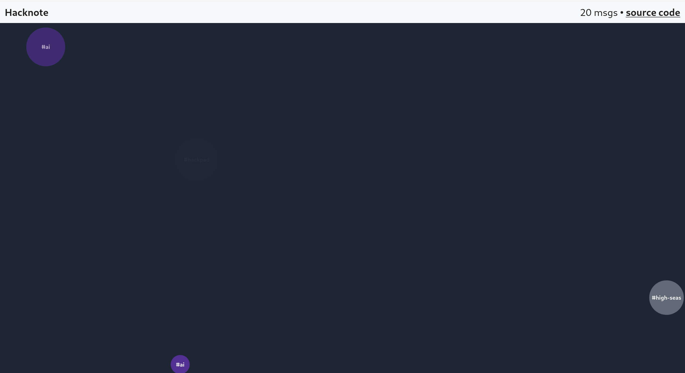

# hacknote

A clone of [Hatnote](http://listen.hatnote.com/), but with Hack Club Slack messages. This is my first project with D3.js.

White circles are regular messages and purple messages are those that are sent in threads. It uses [Tone.js](https://tonejs.github.io/) to play sounds. The higher the chord, the longer the message is.